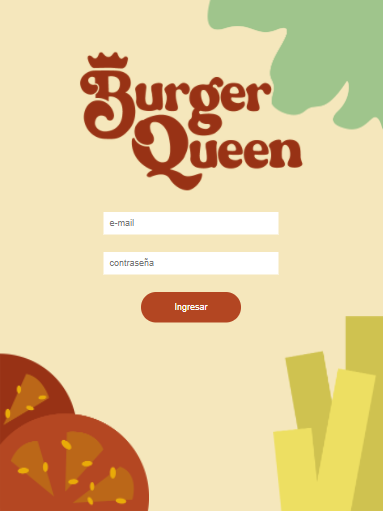
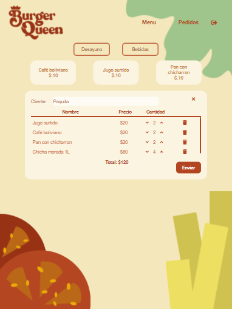
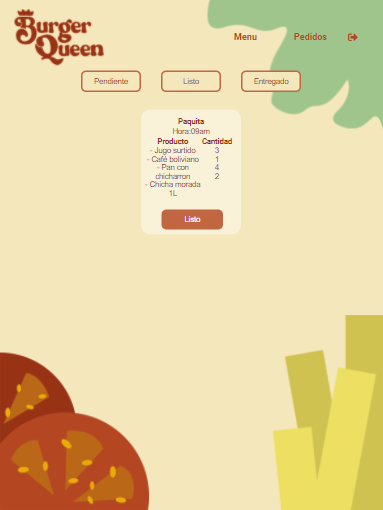
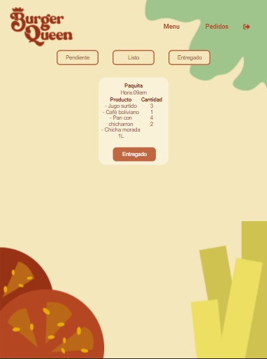
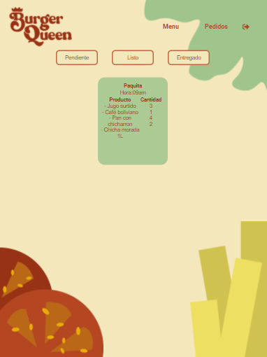

# Burger Queen (API Client)

## Índice

- [1. Preámbulo](#1-preámbulo)
- [2. Resumen del proyecto](#2-resumen-del-proyecto)
- [3. Interfaz](#3-interfaz)

---

## 1. Preámbulo

Un pequeño restaurante de hamburguesas, que está creciendo, necesita un
sistema a través del cual puedan tomar pedidos usando una _tablet_, y enviarlos
a la cocina para que se preparen ordenada y eficientemente.

Este proyecto tiene dos áreas: interfaz (cliente) y API (servidor). Nuestra
clienta nos ha solicitado desarrollar la interfaz que se integre con la API
que otro equipo de desarrolladoras está trabajando simultáneamente

## 2. Resumen del proyecto

Este proyecto consta de dos vistas: la del administrador y trabajador.

En esta sección el trabajador puede logearse mediante un correo electrónico otrorgado por el administrador del negocio. En él puede guardar el nombre del cliente, llevar los pedidos al carrito de compras y enviar las órdenes a la siguiente vista.

## 3. Interfaz

La interfaz del logueo.

El mesero puede guardar los pedidos con el nombre del cliente.

La orden se va a la vista de pedidos pendientes.

La orden se va a la vista de pedidos listos.

La orden se va a la vista de pedidos terminados.

